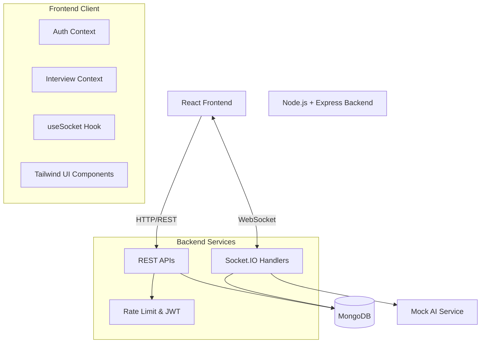

<div align="center">
  <h1>🎤 InterviewAI</h1>
  <p><strong>An AI-powered mock interview platform</strong></p>
  <p>Practice with personalized, realistic interviews and get detailed performance feedback to ace your next job interview.</p>

  <div>
    
    
    
    
    
  </div>
</div>

<br />

## 📑 Table of Contents

- [Features](#-features)
- [Architecture](#-architecture)
- [Tech Stack](#-tech-stack)
- [Getting Started](#-getting-started)
- [Folder Structure](#-folder-structure)
- [API Endpoints](#-api-endpoints)
- [Contributing](#-contributing)
- [License](#-license)

---

## ✨ Features

- 🧠 **AI Interviewer** — Experience a realistic mock interview conducted by "Alex", a simulated AI interviewer tailored to your field.
- 💬 **Real-Time Streaming Chat** — Word-by-word streaming responses powered by Socket.IO for a natural conversation flow.
- 📄 **Resume Context** — Upload your PDF resume for personalized, context-aware question generation.
- 🎯 **Role & Company Targeting** — Get tailored questions specifically designed for your target roles and dream companies.
- 💻 **Integrated Coding Round** — Practice technical rounds in a built-in Monaco Editor with syntax highlighting for JS, Python, Java, and C++.
- 📊 **Detailed Performance Report** — Receive a comprehensive scorecard with a radar chart, strength analysis, and actionable improvement tips.
- 🔐 **Secure Authentication** — JWT-based authentication system ensuring secure sessions with access and refresh tokens.
- 📱 **Fully Responsive** — A seamless experience across desktop and mobile devices.

---

## 🏗 Architecture



---

## 🛠 Tech Stack

### Frontend
- **Framework:** React 18 (Vite)
- **Styling:** Tailwind CSS
- **Animations:** Framer Motion
- **Data Visualization:** Recharts
- **Code Editor:** Monaco Editor
- **Real-time:** Socket.IO Client
- **Routing:** React Router DOM
- **HTTP Client:** Axios

### Backend
- **Environment:** Node.js 18+
- **Framework:** Express.js
- **Database:** Mongoose / MongoDB
- **Real-time:** Socket.IO
- **Authentication:** JSON Web Tokens (JWT) & bcryptjs
- **File Uploads:** Multer (local storage)
- **Security:** Helmet, express-rate-limit, CORS

---

## 🚀 Getting Started

### Prerequisites

Ensure you have the following installed on your machine:
- [Node.js](https://nodejs.org/en/) (v18 or higher)
- [MongoDB](https://www.mongodb.com/) (Local instance or MongoDB Atlas)
- [Git](https://git-scm.com/)

### 1. Clone the repository

```bash
git clone https://github.com/your-username/interviewai.git
cd interviewai
```

### 2. Install Dependencies

You'll need to install dependencies for both the frontend and backend.

**Server:**
```bash
cd server
npm install
```

**Client:**
```bash
cd ../client
npm install
```

### 3. Environment Variables

The project already contains default `.env` configurations for local development.

**`server/.env`:**
```env
PORT=5000
MONGODB_URI=mongodb://localhost:27017/interviewai
JWT_SECRET=interviewai_jwt_secret_mvp_2024
JWT_REFRESH_SECRET=interviewai_refresh_secret_mvp_2024
CLIENT_URL=http://localhost:5173
```

**`client/.env`:**
```env
VITE_API_URL=http://localhost:5000/api
VITE_SOCKET_URL=http://localhost:5000
```

### 4. Start Development Servers

You can start both servers concurrently, or in separate terminals. 
*Note: there are `start-server.bat` and `start-client.bat` scripts in the root directory for Windows users.*

**Terminal 1 — Backend:**
```bash
cd server
npm run dev
```

**Terminal 2 — Frontend:**
```bash
cd client
npm run dev
```

Open your browser and navigate to `http://localhost:5173` to view the app!

---

## 📂 Folder Structure

```
interviewai/
├── client/                  # React frontend application
│   ├── src/
│   │   ├── api/             # Axios API client instances
│   │   ├── components/      # Reusable UI, Interview, and Report components
│   │   ├── context/         # React Context (Auth, Interview state)
│   │   ├── hooks/           # Custom React hooks (e.g., useSocket)
│   │   ├── pages/           # Application route pages
│   │   └── utils/           # Helper functions and utilities
│   └── vite.config.js       # Vite bundler configuration
│
└── server/                  # Node.js/Express backend application
    ├── src/
    │   ├── config/          # DB connection and app config
    │   ├── controllers/     # Route logic (Auth, Interview)
    │   ├── middleware/      # JWT verification, upload handling, rate limiting
    │   ├── models/          # MongoDB Mongoose schemas
    │   ├── routes/          # Express API route definitions
    │   ├── services/        # Business logic (e.g., Mock AI service)
    │   └── socket/          # Socket.IO connection and event handlers
    └── index.js             # Server entry point
```

---

## 🔌 API Endpoints

### Authentication
| Method | Route | Description |
|--------|-------|-------------|
| `POST` | `/api/auth/register` | Register a new user |
| `POST` | `/api/auth/login` | Login and receive tokens |
| `GET` | `/api/auth/me` | Fetch current authenticated user |

### Interview
| Method | Route | Description |
|--------|-------|-------------|
| `POST` | `/api/interview/start` | Initialize a new interview session |
| `POST` | `/api/interview/message` | Send chat message to AI |
| `POST` | `/api/interview/evaluate-answer` | Submit an answer for scoring |
| `POST` | `/api/interview/evaluate-code` | Submit a code snippet for scoring |
| `POST` | `/api/interview/report/generate` | Finalize and generate performance report |
| `GET` | `/api/interview/user/sessions` | Retrieve all past sessions for user |

---

## 🤝 Contributing

We welcome contributions! Please follow these steps:

1. **Fork** the repository
2. **Create a new branch:** `git checkout -b feature/your-feature-name`
3. **Commit your changes:** `git commit -m 'Add some feature'`
4. **Push to the branch:** `git push origin feature/your-feature-name`
5. **Open a Pull Request**

---

## 📄 License

This project is licensed under the MIT License - see the [LICENSE](LICENSE) file for details.

---
<div align="center">
  <p>Built with ❤️ by the InterviewAI Team</p>
</div>
