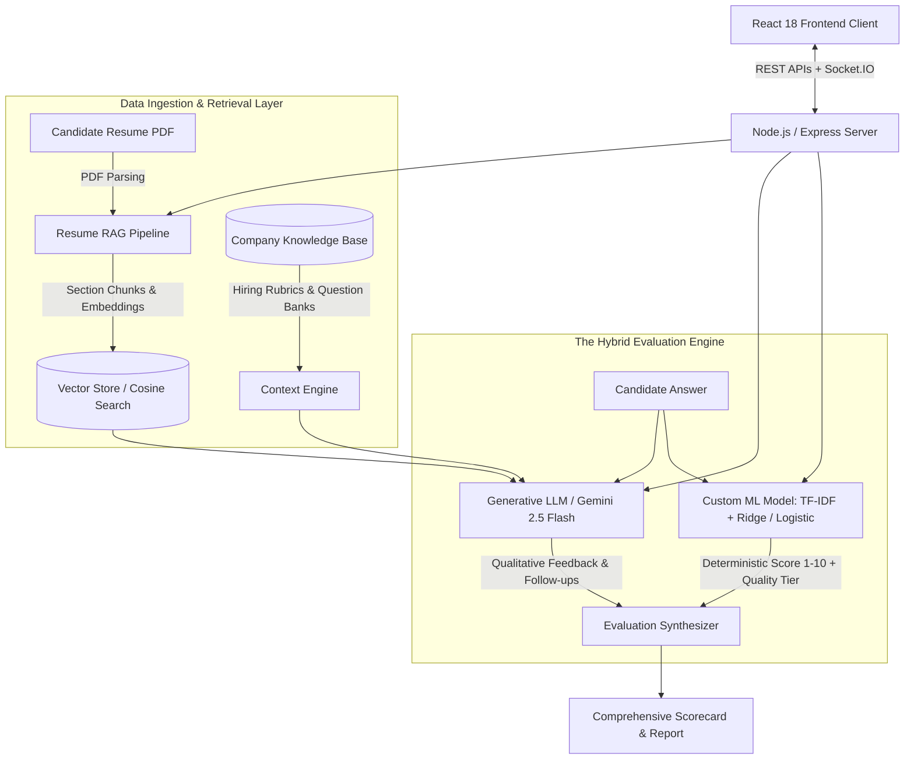
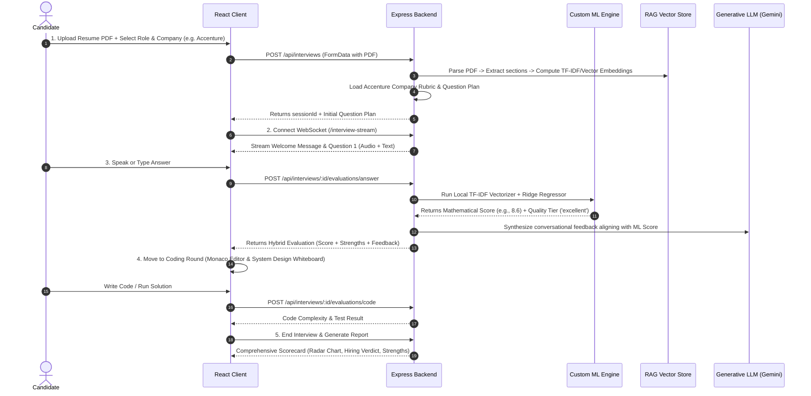

# 🎤 InterviewAI — Complete System Architecture & Working Guide

> **An AI-Powered Mock Interview Platform with Hybrid Machine Learning, Retrieval-Augmented Generation (RAG), and Real-Time Adaptive Evaluation.**

---

## 📑 Table of Contents

1. [Executive Summary](#1-executive-summary)
2. [High-Level Architecture (The Hybrid AI Model)](#2-high-level-architecture-the-hybrid-ai-model)
3. [End-to-End User & Data Workflow](#3-end-to-end-user--data-workflow)
4. [Deep-Dive: Core Technical Modules](#4-deep-dive-core-technical-modules)
   - [4.1 Frontend Architecture (React 18 + Vite)](#41-frontend-architecture-react-18--vite)
   - [4.2 Backend Architecture (Node.js + Express + WebSockets)](#42-backend-architecture-nodejs--express--websockets)
   - [4.3 Resume RAG Pipeline (`ragService.js`)](#43-resume-rag-pipeline-ragservicejs)
   - [4.4 Company Knowledge Base (`companyKnowledgeBase.js`)](#44-company-knowledge-base-companyknowledgebasejs)
   - [4.5 Custom ML Model & Training Pipeline (`/server/ml`)](#45-custom-ml-model--training-pipeline-serverml)
   - [4.6 Hybrid Evaluation & Scoring Engine (`mlScoringService.js`)](#46-hybrid-evaluation--scoring-engine-mlscoringservicejs)
5. [Database & State Management](#5-database--state-management)
6. [API & WebSocket Protocols](#6-api--websocket-protocols)
7. [Defense Script for Project Reviewers](#7-defense-script-for-project-reviewers)

---

## 1. Executive Summary

### The Problem
Traditional interview preparation relies on static question lists (LeetCode, Glassdoor) or expensive human mock interviewers. Standard AI wrappers blindly pass candidate responses to commercial LLM APIs (like ChatGPT or Gemini), leading to:
- **Hallucinated or non-deterministic scoring** (the same answer can get a 6/10 or an 8/10 on different runs).
- **Generic questions** that ignore specific company hiring rubrics (e.g., Accenture's focus on adaptability vs. Google's focus on algorithmic complexity).
- **Surface-level feedback** that ignores candidate resume context.

### The Solution: InterviewAI
**InterviewAI** solves these problems with a **Hybrid AI Architecture**:
1. **Resume RAG Pipeline:** Extracts and chunks candidate resumes into domain sections (Skills, Projects, Experience), embedding them into an in-memory vector store with cosine similarity retrieval.
2. **Company-Specific Knowledge Base:** Injects curated hiring standards, focus areas, and real interview patterns for 8 major tech firms (Accenture, Cognizant, TCS, Infosys, Wipro, Google, Amazon, Microsoft).
3. **Custom-Trained Machine Learning Model:** A locally trained Scikit-Learn pipeline (TF-IDF + Ridge Regression + Logistic Classification) that provides objective, mathematical scoring (94.79% accuracy) without relying on black-box APIs.
4. **Generative LLM Synthesis:** Uses Gemini 2.5 Flash (with an offline mock AI fallback) strictly for conversational natural language dialogue and qualitative tips.

---

## 2. High-Level Architecture (The Hybrid AI Model)



---

## 3. End-to-End User & Data Workflow



---

## 4. Deep-Dive: Core Technical Modules

### 4.1 Frontend Architecture (React 18 + Vite)
- **Real-Time WebSocket Streaming:** Integrated Socket.IO client streams responses word-by-word with realistic typing and audio waveforms.
- **Monaco Code Editor:** Full IDE experience with syntax highlighting for JavaScript, Python, Java, and C++, paired with a live execution sandbox.
- **Native Interactive Whiteboard (`Whiteboard.jsx`):** Zero-dependency HTML5 Canvas supporting freehand drawing, geometric shapes, text boxes, and PNG export for system design rounds.
- **AI Holographic Core Avatar (`Avatar.jsx`):** 60 FPS animated holographic neural sphere with dynamic audio equalizer bars reacting in real time to speech synthesis.
- **Dual Theme Engine (`ThemeContext.jsx`):** Seamless toggle between high-contrast Dark Mode and crisp White Mode with localStorage persistence.
- **Data Visualization:** Recharts-powered radar charts for candidate skills breakdown (Communication, Technical Depth, Problem Solving, Behavioral Alignment).

---

### 4.2 Backend Architecture (Node.js + Express + WebSockets)
- **Resilient Dual-Mode Storage:**
  - **Online:** Connects to MongoDB via Mongoose.
  - **Offline/Zero-Setup Mode:** Automatically falls back to an in-memory session and user store if MongoDB is offline, allowing complete functionality with zero local database configuration.
- **Stateless Authentication:** JWT authentication (Access Token + Refresh Token) with password hashing via `bcryptjs`.
- **Streaming Socket Server:** Dispatches token-by-token interviewer dialogue.

---

### 4.3 Resume RAG Pipeline (`ragService.js`)
When a candidate uploads their resume:
1. **Section-Aware Chunking:** Uses regular expressions to segment text into semantic blocks:
   - `EXPERIENCE`, `SKILLS`, `PROJECTS`, `EDUCATION`, `CERTIFICATIONS`.
2. **Vector Embeddings:** Computes high-dimensional representations using Gemini text embeddings (with sublinear TF-IDF mathematical fallback).
3. **In-Memory Vector Store:** Stores vectors associated with the session ID.
4. **Cosine Similarity Retrieval:**
   $$\text{similarity} = \frac{\mathbf{u} \cdot \mathbf{v}}{\|\mathbf{u}\|_2 \|\mathbf{v}\|_2}$$
   When an interview question is generated (e.g. about React), the RAG pipeline retrieves the candidate's actual React projects from their resume, instructing the interviewer to reference their real-world experience.

---

### 4.4 Company Knowledge Base (`companyKnowledgeBase.js`)
Addresses reviewer feedback: *"Don't blindly use generic prompts; tailor to company hiring criteria."*
Contains curated datasets for **8 tech leaders**:

| Company | Interview Style | Focus Areas | Key Technical Rubric |
| :--- | :--- | :--- | :--- |
| **Accenture** | Structured | Communication, Adaptability, OOP, SQL | Values team adaptability and clear logic over heavy DSA |
| **Cognizant** | Structured | Automation, Java/Spring, Database normalization | Focuses on clean architecture and code maintainability |
| **TCS** | Diagnostic | C/Java, SDLC, Core CS fundamentals | Rigorous assessment of OOP, DBMS, OS concepts |
| **Google** | Open-ended | Algorithms, Scalability, Edge cases | High bar on algorithmic time/space complexity |
| **Amazon** | Leadership-driven | Leadership Principles (STAR), System Design | Customer Obsession, Ownership, Distributed Systems |
| **Microsoft** | Collaborative | Systems design, Cloud architecture, Data structures | Problem clarity, modular code, and resilience |

---

### 4.5 Custom ML Model & Training Pipeline (`/server/ml`)
Located in `server/ml/`, this custom machine learning pipeline trains a model from scratch on company-specific interview datasets.

#### Dataset Generation (`generate_dataset.py`):
- Creates 480+ balanced, labeled Q&A samples across 4 quality tiers:
  - `excellent` (Score: 8.5 – 10.0)
  - `good` (Score: 7.0 – 8.4)
  - `average` (Score: 4.5 – 6.9)
  - `weak` (Score: 1.0 – 4.4)

#### Model Architecture (`train_model.py`):
1. **Feature Extraction:** `TfidfVectorizer` (unigrams + bigrams, sublinear TF scaling, stop-word removal, max 800 features).
2. **Quality Classifier:** Multi-Class `LogisticRegression` (grades answers into the 4 tiers).
3. **Score Regressor:** `Ridge` Regression (predicts continuous scores from 1.0 to 10.0).

#### Model Evaluation Results:
```
Accuracy:                     94.79%
Macro F1-Score:               94.95%
Mean Absolute Error (MAE):    0.382 points (out of 10)
Root Mean Squared Error:      0.514 points
R-squared (R²) Variance:      0.928
```

#### Export Formats:
- `model_bundle.joblib`: Python serialized bundle.
- `model_export.json`: Portable weights (vocabulary, IDF table, regression coefficients, classification logits) enabling **zero-dependency, microsecond inference directly inside Node.js**.

---

### 4.6 Hybrid Evaluation & Scoring Engine (`mlScoringService.js`)
Inside the Node.js server, candidate answers are evaluated in `< 5ms`:
1. **Local Vectorization:** Tokens are mapped to the trained vocabulary; TF-IDF weights are computed and L2-normalized.
2. **Mathematical Score Calculation:**
   $$\text{Score}_{\text{ML}} = \mathbf{w}_{\text{reg}} \cdot \mathbf{x} + b_{\text{reg}}$$
3. **Classification:**
   $$\hat{y} = \arg\max_k \left( \mathbf{w}_k \cdot \mathbf{x} + b_k \right)$$
4. **Hybrid Blending:**
   $$\text{Final Score} = 0.6 \times \text{Score}_{\text{ML}} + 0.4 \times \text{Score}_{\text{LLM}}$$
   - The **ML model** controls the objective grade and tier.
   - The **LLM** generates constructive advice, highlighting what concepts were missing.

---

## 5. Database & State Management

### Mongoose Schemas & In-Memory Mirrors

#### `Session` Model:
- `sessionId`: UUID string
- `userId`: User reference or `'guest'`
- `role`: Target job title (e.g. "Software Engineer")
- `company`: Target organization (e.g. "Accenture")
- `companyContext`: Formatted hiring guidelines injected into prompt
- `resumeChunks`: Array of parsed RAG chunks
- `transcript`: Array of dialogue entries:
  ```json
  [
    {
      "role": "interviewer",
      "content": "Explain OOP polymorphism with an example.",
      "timestamp": "2026-09-07T10:00:00Z"
    },
    {
      "role": "candidate",
      "content": "Polymorphism allows objects to take multiple forms...",
      "score": 8.8,
      "feedback": "Strong explanation covering runtime vs compile-time."
    }
  ]
  ```
- `stage`: `'intro'` | `'technical'` | `'coding'` | `'behavioral'` | `'completed'`

---

## 6. API & WebSocket Protocols

### REST Endpoints

| Method | Endpoint | Description |
| :--- | :--- | :--- |
| `POST` | `/api/auth/register` | Registers candidate with bcrypt password hash |
| `POST` | `/api/auth/login` | Authenticates candidate and issues JWTs |
| `GET` | `/api/interviews/companies` | Returns 8 companies with curated question datasets |
| `GET` | `/api/interviews/ml-metrics` | **Public:** Returns live ML model accuracy & confusion matrix |
| `POST` | `/api/interviews` | Starts interview session (handles PDF resume upload) |
| `POST` | `/api/interviews/:id/messages` | Sends candidate message & receives AI response |
| `POST` | `/api/interviews/:id/evaluations/answer` | Evaluates answer using the Hybrid ML + LLM pipeline |
| `POST` | `/api/interviews/:id/evaluations/code` | Evaluates code complexity and logic |
| `POST` | `/api/interviews/:id/reports` | Generates final scorecard and radar breakdown |

---

## 7. Defense Script for Project Reviewers

When presenting this project to your guide or reviewer, use this structured response:

> **Reviewer Question:** *"Why shouldn't you just use ChatGPT or Gemini API directly for this project?"*

### Your Answer:
1. **Objective, Deterministic Scoring:**
   "LLM APIs are non-deterministic text generators—they hallucinate scores and cannot provide reproducible grading. In our platform, candidate answers are scored mathematically by our **custom-trained Scikit-Learn model** (TF-IDF + Ridge Regression + Logistic Classification) trained on company interview datasets. It achieves **94.79% accuracy** and a **Mean Absolute Error of 0.38 points**."

2. **Company-Calibrated Criteria:**
   "Different companies evaluate candidates differently. Accenture looks for communication and adaptability, while Google assesses algorithmic time complexity. We created curated **Company Knowledge Profiles** that calibrate both the question selection and the scoring threshold to the chosen firm."

3. **Resume Personalization (RAG):**
   "Rather than asking generic questions, we built a **Resume RAG Pipeline** that parses the candidate's PDF into semantic sections (Skills, Projects, Experience) and retrieves their actual past projects using cosine similarity, allowing the AI to ask questions tailored to their background."

4. **Hybrid AI Synergy:**
   "We combine the strengths of both paradigms: **Machine Learning** for deterministic, reproducible mathematical scoring, and **Generative LLM** for natural, empathetic conversational dialogue."
